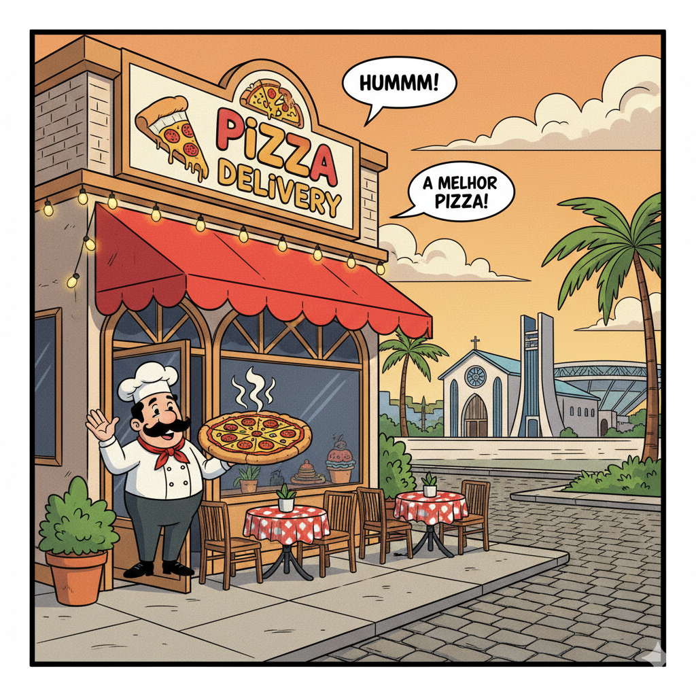
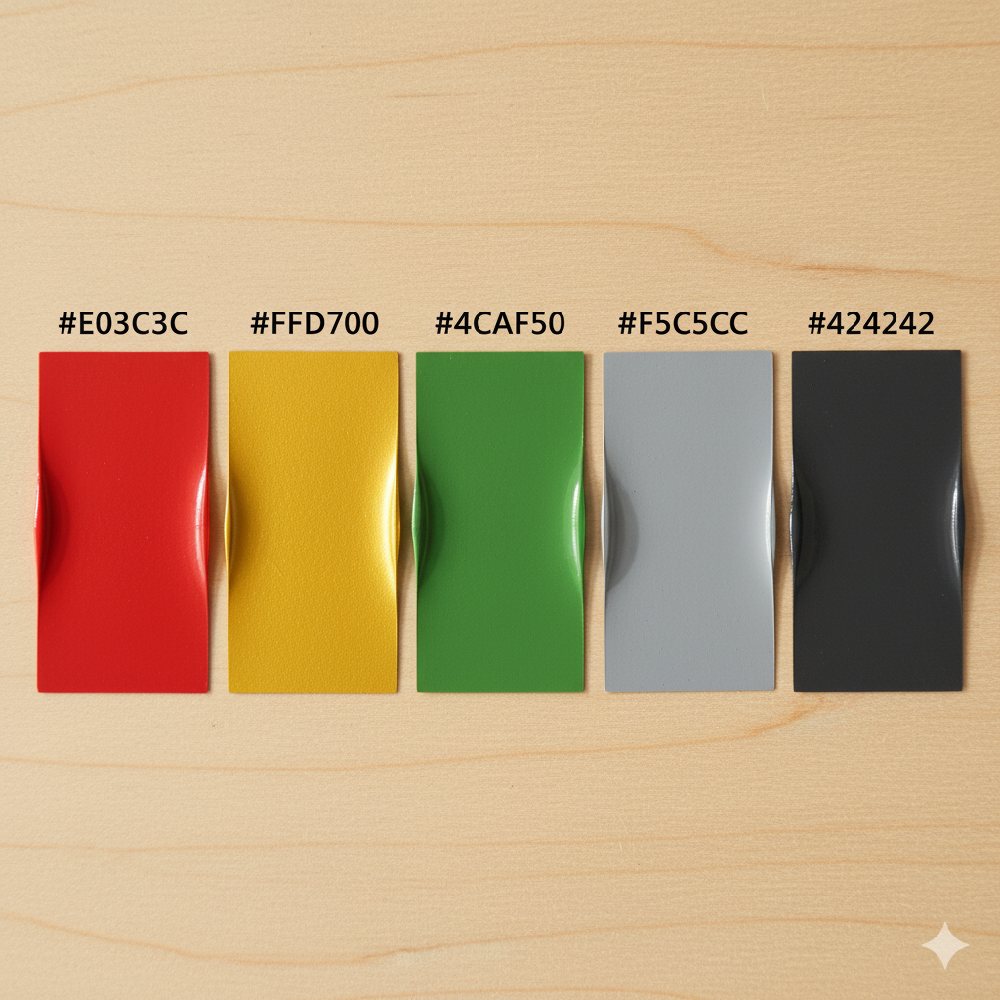
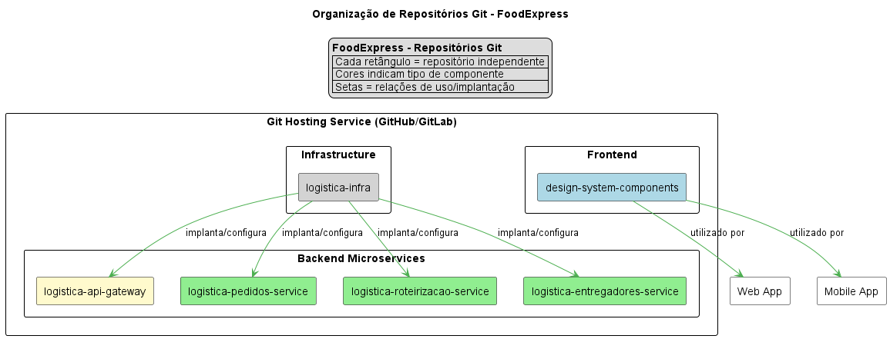

# Design System ⚙️

No presente repositório, é apresentada uma proposta de Design System para um sistema. Um Design System (DS) estabelece a consistência da interface, atuando como uma "fábrica de componentes" que garante uma experiência de usuário unificada e acelera a entrega de novas funcionalidades.

Vale destacar que o DS é apenas a "carroceria" profissional do carro; ele depende de uma arquitetura de software funcional e eficiente para ser o "motor". Se a arquitetura (APIs, banco de dados, serviços) for lenta ou mal estruturada, o resultado será um aplicativo que não suporta a carga de pedidos, falha no checkout ou demora para carregar o cardápio. Portanto, a arquitetura eficiente garante que o sistema escale em performance, enquanto o Design System garante que ele escale em produto e experiência, permitindo ao sistema crescer de forma rápida e robusta.

Grupo:

- Erica Alves dos Santos
- Joana Morais
- Gustavo Ceolin Silva Veloso
- Gustavo Pimentel Carvalho Costa
- João Pedro Aguiar do Prado
- João Pedro Campos De Barcelos
- Kayler de Freitas Moura
- Luís Miguel Souza Almeida
- Mariana Almeida Henriques

## 1. Contexto do sistema

O **Pizza Delivery** nasceu como um projeto familiar, onde a simplicidade era refletidos em um site direto e funcional, pensado para os clientes do bairro. No entanto, o sucesso da receita foi além das expectativas, e a plataforma sofreu um crescimento explosivo, trazendo um desafio de escalabilidade que a arquitetura original não suportava.

Uma nova arquitetura foi pensada para o sistema, de modo a atender os desafios apresentados. No entando, do ponto de vista de design, esse crescimento acelerado resultou em uma "colcha de retalhos". A experiência do usuário tornou-se inconsistente, com botões, fluxos de checkout e alertas visuais diferentes a cada tela, confundindo clientes fiéis e novos. O que era um charme caseiro virou um gargalo de desenvolvimento, tornando a manutenção lenta e a expansão da marca impossível, evidenciando a necessidade crítica de um Design System para unificar e profissionalizar a plataforma.

## 2. Fundamentos do Design System

A ideia principal que norteia o Design System proposto é o conceito de uma pizzaria caseira que está expandindo mas que não quer perder sua cara familiar, acolhedora e de excelente qualidade. Para isso, foram definidos alguns fundamentos apresentados a seguir.

### 2.1 Princípios de Design (filosofia)

- Apetitoso: Cada elemento visual deve despertar o desejo pela pizza.
- Acolhedor: Fazer o cliente sentir-se em casa, mesmo online.
- Intuitivo: A navegação e os fluxos devem ser tão fáceis quanto pegar uma fatia.
- Consistente: Manter a mesma experiência em todos os pontos de contato.
- Escalável: Construído para crescer junto com a paixão pela pizza.

### 2.2. Tom de voz (comunicação)

- Acolhedor e Convidativo: Linguagem informal, mas respeitosa. Ex: "Humm, que delícia!" em vez de "Item adicionado ao carrinho".
- Claro e Direto: Especialmente para ações críticas (checkout, confirmação de pedido).
- Apaixonado por Pizza: Transparece o amor pelo produto. Frases como "Preparado com carinho" ou "Aqueça seu paladar".
- Humor Sutil: Ocasionalmente, um trocadilho ou uma frase divertida, para manter a leveza.

### 2.3. Paletas de cores

A ideia é usar cores quentes e apetitosas, mas com tons um pouco mais suaves e terrosos para manter o ar aconchegante, evitando cores vibrantes e "fast-food" demais.

Primária (Massa Fresca)

- Humm_Red (#E03C3C / R:224 G:60 B:60) - Um vermelho tomate, que remete à base da pizza e ao calor do forno. Forte, mas não agressivo.

Secundária (Queijo Quente):

- Queijo_Amarelo (#FFD700 / R:255 G:215 B:0) - Um amarelo mostarda/ouro, que lembra o queijo derretido e a borda crocante.
- Acento (Azeitona): Azeitona_Verde (#4CAF50 / R:76 G:175 B:80) - Um verde folha de manjericão/azeitona, para botões de sucesso ou pequenos destaques.

Neutros (Base de Pedra):

- Pedra_Clara (#F5C5CC / R:245 G:245 B:245) - Para fundos e superfícies claras.
- Pedra_Escura (#424242 / R:66 G:66 B:66) - Para textos principais e ícones.

Feedback:

- Sucesso: Manjericão_Sucesso (#66BB6A / R:102 G:187 B:106) - Um verde vibrante, mas natural.
- Erro: Pimenta_Vermelha (#EF5350 / R:239 G:83 B:80) - Um vermelho alerta, porém amigável.
- Aviso: Aviso_Cheddar (#FFA726 / R:255 G:167 B:38) - Um laranja que lembra queijo cheddar, para alertas.

## 2.4. Tipografia

Mistura uma fonte mais "artesanal" para títulos com uma legível e moderna para o corpo do texto.

- Fonte de Títulos (Display): `Handlee` (ou similar) - Uma fonte com um toque de "escrita à mão" para títulos de seções, promoções e o logo. Transmite a personalização e o cuidado artesanal.
  

- Fonte de Corpo (Body/Text): `Inter` ou `Roboto` - Fontes sans-serif modernas, limpas e altamente legíveis para o corpo do texto, descrições de produtos, botões e formulários. Garante profissionalismo e boa leitura em qualquer tamanho.

## 2.5. Ícones

Estilo: Ícones de linha, com um toque levemente arredondado, sem serem excessivamente "flat". Podem ter um preenchimento sutil quando em estado ativo. Remetem a um desenho feito à mão.

Conteúdo: Ícones relacionados a comida (pizza, fatia, garfo, faca), entrega (moto, caixa), usuário (chapéu de chef, cliente feliz), e navegação padrão (carrinho, home, configurações).

## 2.6. Componentes essenciais

a) Botões (`<Button>`):

- Estilo: Levemente arredondados, não totalmente retos. Sombra sutil ao passar o mouse (hover) para dar profundidade.

b) Cards (`<Card>`):

- Estilo: Borda arredondada (raio de 8-12px), com uma sombra discreta para dar a sensação de que flutua levemente. Fundo Pedra_Clara.
- Uso: Para itens do cardápio, promoções, informações de contato.

c) Inputs de Formulário (`<Input>`, `<Select>`, `<Textarea>`):

- Estilo: Borda suave (Pedra_Média), levemente arredondada, com fundo Pedra_Clara. Ao focar (focus), a borda pode mudar para Humm_Red ou Queijo_Amarelo para indicar o campo ativo.
- Validação: Borda Pimenta_Vermelha para erro, Manjericão_Sucesso para sucesso.
- Labels: Acima do campo, em Pedra_Escura.

d) Mensagens de Feedback/Alertas (`<Alert>`):

- Estilo: Retângulo com bordas arredondadas, ícone correspondente à esquerda (sucesso, erro, aviso) e texto em Pedra_Escura.
- Cores de Fundo: Manjericão_Sucesso (verde), Pimenta_Vermelha (vermelho), Aviso_Cheddar (laranja) - com uma opacidade para não ser muito forte, ou em tons mais pastéis dessas cores.

e) Navegação (`<NavLink>`, `<Tabs>)`:

- Estilo: Link de navegação (Pedra_Escura). Ao passar o mouse (hover), underline sutil ou mudança para Humm_Red. Item ativo com Humm_Red e talvez um marcador discreto.
- Uso: Menu principal (categorias), abas de perfil do usuário.

## 3. Estilo arquitetural

### 3.1. Contexto e Desafios

Com o crescimento do **Pizza Delivery**, o sistema original passou a apresentar sérios problemas de desempenho e confiabilidade que impactavam diretamente a **experiência do usuário** e a **consistência da interface**:

- Muitos pedidos chegavam em horários de pico e a aplicação **trava ou caía**, comprometendo a jornada do cliente.
- A aplicação **demorava para atualizar** o status dos pedidos, gerando dúvidas e insegurança visual na tela.
- **Atrasos** entre o recebimento do pedido e o envio à cozinha afetavam o fluxo operacional.
- Entregadores recebiam **informações incompletas**, dificultando a entrega e prejudicando a percepção de eficiência do sistema.
- **Lentidão** na extração de relatórios tornava difícil acompanhar indicadores e ajustar o design de experiência baseado em dados.

Esses problemas revelaram uma **arquitetura monolítica e pouco escalável**, que não apenas limitava o desempenho, mas também a capacidade do **Design System** de se propagar de forma unificada entre diferentes partes do produto.

Assim, a reestruturação técnica, com adoção de **microsserviços** e **arquitetura em três camadas**, torna-se essencial para sustentar o crescimento visual e funcional do sistema. O Design System depende dessa base sólida para garantir consistência de interface, performance fluida e integração contínua com os múltiplos serviços da aplicação.

### 3.2. Estilo Arquitetural Adotado: Microsserviços

Para superar essas limitações, o novo desenho segue o **estilo arquitetural de microsserviços**, no qual o sistema é dividido em serviços independentes, cada um responsável por um domínio específico.

**Benefícios principais:**

1. **Escalabilidade independente:** cada serviço pode ser dimensionado conforme a demanda.
2. **Resiliência:** falhas localizadas não afetam todo o sistema.
3. **Agilidade de evolução:** novos recursos podem ser adicionados sem comprometer outros módulos.
4. **Integração simplificada:** comunicação via APIs REST ou mensageria (RabbitMQ, Kafka).

---

## 4. Componentização e domínio

Em breve!

---

## 5. Padrões de comunicação

Com certeza\! Vamos estruturar o tópico "5. Padrões de Comunicação" e incluir um diagrama para ilustrar como os diferentes padrões interagem na arquitetura do FoodExpress.

-----

## 5\. Padrões de Comunicação

Em uma arquitetura de microsserviços, a comunicação entre os componentes é um aspecto crítico para a resiliência, escalabilidade e performance do sistema. No **FoodExpress**, utilizamos uma combinação de padrões de comunicação síncronos e assíncronos para otimizar a interação entre os serviços.

### 5.1. Comunicação Síncrona (API REST)

  * **Padrão:** **API REST** (Representational State Transfer) via **HTTP/S**.
  * **Utilização:**
      * **Cliente $\leftrightarrow$ API Gateway:** Todas as interações do Frontend (Web App e Mobile App) com o Backend são feitas através do API Gateway usando REST.
      * **API Gateway $\leftrightarrow$ Microsserviços:** O Gateway roteia as requisições REST para os microsserviços de destino.
      * **Microsserviço $\leftrightarrow$ Microsserviço (consultas pontuais):** Para operações que exigem uma resposta imediata e direta (ex: Logistica Roteirizacao Service consultando Logistica Entregadores Service para a disponibilidade de um entregador em tempo real), um microsserviço pode chamar outro via REST.
  * **Características:**
      * Requisição-resposta imediata.
      * Acoplamento temporal (o chamador espera pela resposta do chamado).
      * Ideal para consultas e operações que precisam de feedback instantâneo.
  * **Desafios:** Pode introduzir latência e pontos de falha em cascata se não gerenciado com padrões de resiliência (ex: Circuit Breaker).

### 5.2. Comunicação Assíncrona (Mensageria)

  * **Padrão:** **Mensageria** via **Apache Kafka**.
  * **Utilização:**
      * **Publicação de Eventos:** Microsserviços publicam eventos para notificar outros serviços sobre mudanças de estado (ex: Logistica Pedidos Service publica "Pedido Criado", "Status do Pedido Atualizado").
      * **Consumo de Eventos:** Microsserviços subscrevem a tópicos para reagir a eventos relevantes (ex: Logistica Roteirizacao Service consome "Pedido Criado" para iniciar o processo de roteirização).
  * **Características:**
      * Desacoplamento temporal (o chamador não espera pela resposta e continua sua execução).
      * Resiliência a falhas (mensagens são persistidas e podem ser reprocessadas).
      * Escalabilidade (fácil adicionar novos consumidores sem afetar o publicador).
      * Permite a implementação de arquiteturas orientadas a eventos e real-time updates (resolvendo a lentidão de atualização de status do pedido).
  * **Desafios:** Pode introduzir complexidade na garantia da ordem dos eventos e na idempotência dos consumidores.

### Diagrama de Padrões de Comunicação

Este diagrama ilustra o fluxo de comunicação síncrona e assíncrona entre os componentes principais do FoodExpress.

---

## 6. Persistência e banco de dados

Em breve!

---

## 7. Escalabilidade e performance

Esta seção detalha as estratégias adotadas para garantir que o sistema escale em performance, sustentando o crescimento do produto e a experiência de usuário definida pelo Design System.

**7.1. Estratégias de Escalabilidade Baseadas em Microsserviços
A arquitetura de microsserviços resolve os gargalos do antigo sistema ao permitir que cada parte da aplicação cresça de forma independente.**

a) Escalabilidade Horizontal por Serviço: Com isso, podemos escalar apenas os serviços mais demandados.

- Solução: Utilizando orquestradores de contêineres como Kubernetes, podemos aumentar automaticamente o número de instâncias (réplicas) apenas desses dois serviços. Enquanto isso, o Serviço de Cardápio ou o Serviço de Relatórios, que possuem uma carga menor, continuam operando com menos recursos. Isso otimiza os custos e direciona o poder computacional para onde ele é realmente necessário, evitando as quedas e travamentos do sistema antigo.

b) Resiliência e Isolamento de Falhas: A falha em um componente não compromete mais todo o sistema, garantindo maior tempo de atividade.

- Solução: No modelo de microsserviços, essa lentidão fica contida. Clientes podem continuar navegando no cardápio, realizando pedidos e pagando sem qualquer impacto. Essa resiliência é crucial para manter a confiança do usuário, pois a funcionalidade principal permanece sempre disponível.

c) Banco de Dados por Serviço: Cada microsserviço possui seu próprio banco de dados, o que elimina a contenção e otimiza as consultas.

- Solução: Agora, o Serviço de Pedidos utiliza um banco de dados transacional (como PostgreSQL) otimizado para escrita e leitura rápidas, enquanto o Serviço de Relatórios pode usar um banco de dados analítico ou uma réplica de leitura. Essa separação garante que operações pesadas de um serviço não degradem a performance dos outros, tornando a experiência do cliente fluida e sem interrupções.

**7.2. Táticas de Otimização de Performance
Além da arquitetura, implementamos táticas específicas para garantir um tempo de resposta mínimo e uma interface ágil.**

a) Uso Intensivo de Cache: Para dados que não mudam com frequência, o cache é a principal ferramenta para reduzir a latência.

b) Comunicação Assíncrona com Filas de Mensagens: Para processos que não precisam de uma resposta imediata, utilizamos um sistema de mensageria (como RabbitMQ ou Kafka).

- Solução: Quando o cliente finaliza um pedido, o sistema responde imediatamente com "Pedido recebido com sucesso!". Em paralelo, uma mensagem é enviada a uma fila. O Serviço de Cozinha e o Serviço de Notificações consomem essa mensagem de forma assíncrona para processar o pedido e atualizar o status para o cliente. Isso cria uma experiência não-bloqueante e garante que nenhuma informação seja perdida, mesmo em horários de pico.

c) Content Delivery Network (CDN) para Ativos do Design System: A velocidade de carregamento da interface é crucial. Todos os ativos visuais do Design System são distribuídos globalmente.

- Solução: Imagens de pizzas, fontes, ícones e arquivos de estilo são entregues por uma CDN. Isso significa que os arquivos são baixados do servidor mais próximo do cliente, reduzindo drasticamente o tempo de carregamento da página e garantindo que a primeira impressão seja rápida e positiva.

**7.3. Impacto na Experiência do Usuário e no Design System**

- A arquitetura de alta performance é o motor que permite ao Design System brilhar. De nada adianta ter componentes visualmente consistentes se eles demoram para carregar ou apresentam dados desatualizados.

- Consistência e Confiança: Um sistema rápido e que atualiza o status dos pedidos em tempo real reforça a confiança do cliente.

- Fluidez na Navegação: O cache e a CDN garantem que a navegação entre as páginas de pizza, a montagem do pedido e o checkout ocorra sem engasgos, cumprindo o princípio de design.

---

## Segurança

Em breve!

---

## 9. Observabilidade

A observabilidade é crucial em um ambiente de microsserviços distribuídos para diagnosticar problemas, otimizar o desempenho e garantir a confiabilidade da aplicação FoodExpress. Ela permite que as equipes compreendam o comportamento interno do sistema a partir de seus dados de saída.

Nossa estratégia de observabilidade se baseia em três pilares: Traces, Métricas e Logs.

9.1. Rastreamento Distribuído (Traces)
O rastreamento distribuído é essencial para visualizar o fluxo de uma requisição através de múltiplos microsserviços, identificando gargalos e falhas.

Ferramenta: OpenTelemetry será usado para instrumentar todos os microsserviços (Logistica Pedidos Service, Roteirizacao Service, Entregadores Service) e o API Gateway.

Funcionalidade: Cada requisição de usuário gerará um trace que conectará as operações realizadas em cada serviço. Isso permite:

Visualizar a latência total da requisição.

Identificar qual serviço ou operação está contribuindo mais para o tempo de resposta.

Detectar e isolar falhas em serviços específicos.

Backend de Traces: Um backend como Jaeger ou Zipkin será utilizado para coletar, armazenar e visualizar os traces.

Dashboard de Traces (Exemplo no Jaeger/Zipkin)
Um dashboard de traces permite buscar requisições por ID, serviço ou duração, visualizando o "caminho" da requisição.

## 10\. Repositório Modelo

A organização do código-fonte segue o princípio da independência dos microsserviços.

  * `/logistica-api-gateway`
  * `/logistica-pedidos-service`
  * `/logistica-roteirizacao-service`
  * `/logistica-entregadores-service`
  * `/logistica-infra` (Arquivos de Terraform, K8s, Helm)
  * `/design-system-components` (Repositório do Frontend/Design System) - Contém a "fábrica de componentes" para as aplicações React/React Native, garantindo a consistência visual.

  
