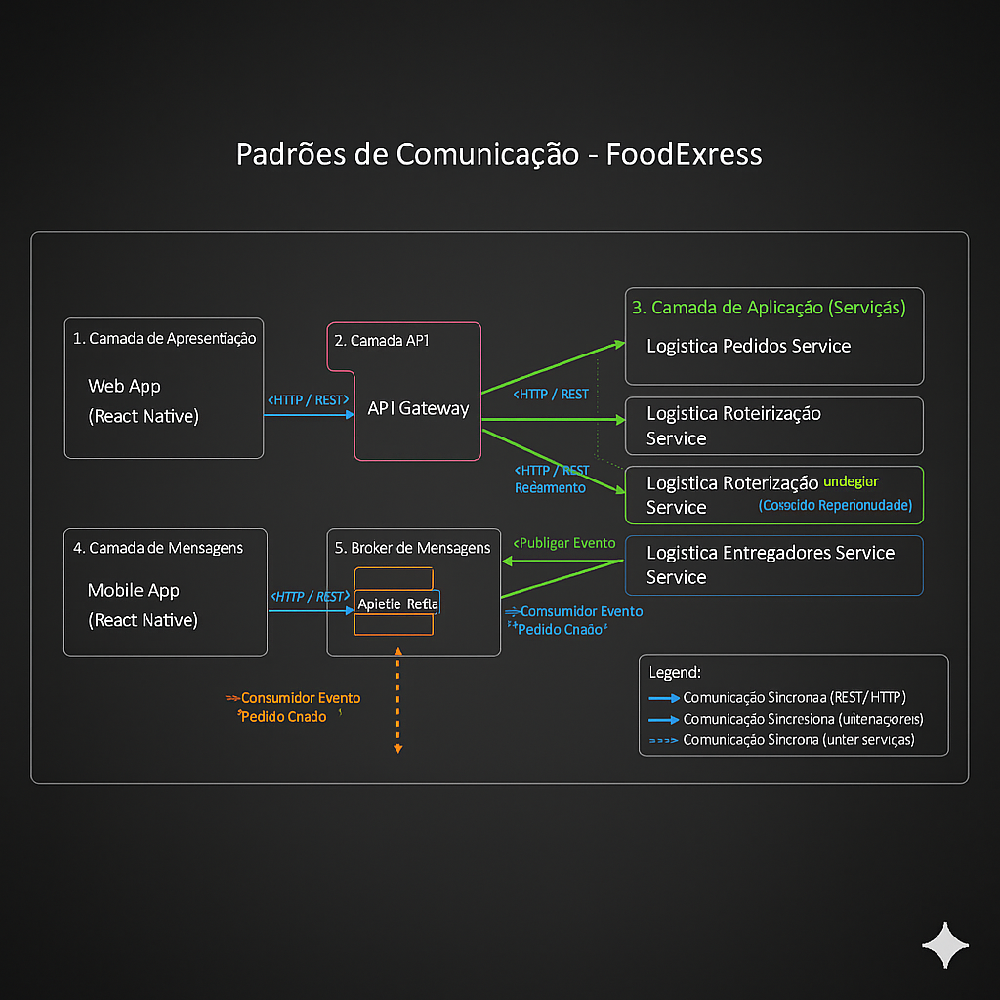
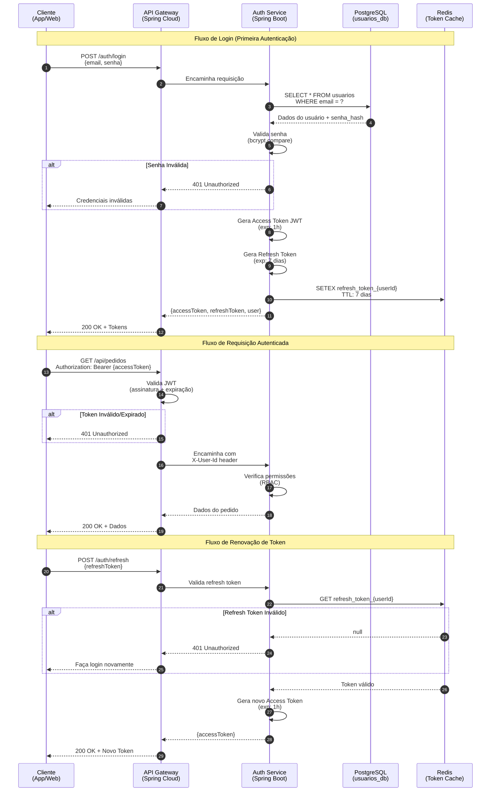

# Design System ⚙️

No presente repositório, é apresentada uma proposta de Design System para um sistema. Um Design System (DS) estabelece a consistência da interface, atuando como uma "fábrica de componentes" que garante uma experiência de usuário unificada e acelera a entrega de novas funcionalidades.

Vale destacar que o DS é apenas a "carroceria" profissional do carro; ele depende de uma arquitetura de software funcional e eficiente para ser o "motor". Se a arquitetura (APIs, banco de dados, serviços) for lenta ou mal estruturada, o resultado será um aplicativo que não suporta a carga de pedidos, falha no checkout ou demora para carregar o cardápio. Portanto, a arquitetura eficiente garante que o sistema escale em performance, enquanto o Design System garante que ele escale em produto e experiência, permitindo ao sistema crescer de forma rápida e robusta.

Grupo:

- Erica Alves dos Santos
- Joana Morais
- Gustavo Ceolin Silva Veloso
- Gustavo Pimentel Carvalho Costa
- João Pedro Aguiar do Prado
- João Pedro Campos De Barcelos
- Kayler de Freitas Moura
- Luís Miguel Souza Almeida
- Mariana Almeida Henriques

## 1. Contexto do sistema

O **Pizza Delivery** nasceu como um projeto familiar, onde a simplicidade era refletidos em um site direto e funcional, pensado para os clientes do bairro. No entanto, o sucesso da receita foi além das expectativas, e a plataforma sofreu um crescimento explosivo, trazendo um desafio de escalabilidade que a arquitetura original não suportava.


Uma nova arquitetura foi pensada para o sistema, de modo a atender os desafios apresentados. No entando, do ponto de vista de design, esse crescimento acelerado resultou em uma "colcha de retalhos". A experiência do usuário tornou-se inconsistente, com botões, fluxos de checkout e alertas visuais diferentes a cada tela, confundindo clientes fiéis e novos. O que era um charme caseiro virou um gargalo de desenvolvimento, tornando a manutenção lenta e a expansão da marca impossível, evidenciando a necessidade crítica de um Design System para unificar e profissionalizar a plataforma.

## 2. Fundamentos do Design System

A ideia principal que norteia o Design System proposto é o conceito de uma pizzaria caseira que está expandindo mas que não quer perder sua cara familiar, acolhedora e de excelente qualidade. Para isso, foram definidos alguns fundamentos apresentados a seguir.

### 2.1 Princípios de Design (filosofia)

- Apetitoso: Cada elemento visual deve despertar o desejo pela pizza.
- Acolhedor: Fazer o cliente sentir-se em casa, mesmo online.
- Intuitivo: A navegação e os fluxos devem ser tão fáceis quanto pegar uma fatia.
- Consistente: Manter a mesma experiência em todos os pontos de contato.
- Escalável: Construído para crescer junto com a paixão pela pizza.

### 2.2. Tom de voz (comunicação)

- Acolhedor e Convidativo: Linguagem informal, mas respeitosa. Ex: "Humm, que delícia!" em vez de "Item adicionado ao carrinho".
- Claro e Direto: Especialmente para ações críticas (checkout, confirmação de pedido).
- Apaixonado por Pizza: Transparece o amor pelo produto. Frases como "Preparado com carinho" ou "Aqueça seu paladar".
- Humor Sutil: Ocasionalmente, um trocadilho ou uma frase divertida, para manter a leveza.

### 2.3. Paletas de cores

A ideia é usar cores quentes e apetitosas, mas com tons um pouco mais suaves e terrosos para manter o ar aconchegante, evitando cores vibrantes e "fast-food" demais.


Primária (Massa Fresca)

- Humm_Red (#E03C3C / R:224 G:60 B:60) - Um vermelho tomate, que remete à base da pizza e ao calor do forno. Forte, mas não agressivo.

Secundária (Queijo Quente):

- Queijo_Amarelo (#FFD700 / R:255 G:215 B:0) - Um amarelo mostarda/ouro, que lembra o queijo derretido e a borda crocante.
- Acento (Azeitona): Azeitona_Verde (#4CAF50 / R:76 G:175 B:80) - Um verde folha de manjericão/azeitona, para botões de sucesso ou pequenos destaques.

Neutros (Base de Pedra):

- Pedra_Clara (#F5C5CC / R:245 G:245 B:245) - Para fundos e superfícies claras.
- Pedra_Escura (#424242 / R:66 G:66 B:66) - Para textos principais e ícones.

Feedback:

- Sucesso: Manjericão_Sucesso (#66BB6A / R:102 G:187 B:106) - Um verde vibrante, mas natural.
- Erro: Pimenta_Vermelha (#EF5350 / R:239 G:83 B:80) - Um vermelho alerta, porém amigável.
- Aviso: Aviso_Cheddar (#FFA726 / R:255 G:167 B:38) - Um laranja que lembra queijo cheddar, para alertas.

## 2.4. Tipografia

Mistura uma fonte mais "artesanal" para títulos com uma legível e moderna para o corpo do texto.

- Fonte de Títulos (Display): `Handlee` (ou similar) - Uma fonte com um toque de "escrita à mão" para títulos de seções, promoções e o logo. Transmite a personalização e o cuidado artesanal.
  

- Fonte de Corpo (Body/Text): `Inter` ou `Roboto` - Fontes sans-serif modernas, limpas e altamente legíveis para o corpo do texto, descrições de produtos, botões e formulários. Garante profissionalismo e boa leitura em qualquer tamanho.


## 2.5. Ícones

Estilo: Ícones de linha, com um toque levemente arredondado, sem serem excessivamente "flat". Podem ter um preenchimento sutil quando em estado ativo. Remetem a um desenho feito à mão.

Conteúdo: Ícones relacionados a comida (pizza, fatia, garfo, faca), entrega (moto, caixa), usuário (chapéu de chef, cliente feliz), e navegação padrão (carrinho, home, configurações).

## 2.6. Componentes essenciais

a) Botões (`<Button>`):

- Estilo: Levemente arredondados, não totalmente retos. Sombra sutil ao passar o mouse (hover) para dar profundidade.

b) Cards (`<Card>`):

- Estilo: Borda arredondada (raio de 8-12px), com uma sombra discreta para dar a sensação de que flutua levemente. Fundo Pedra_Clara.
- Uso: Para itens do cardápio, promoções, informações de contato.

c) Inputs de Formulário (`<Input>`, `<Select>`, `<Textarea>`):

- Estilo: Borda suave (Pedra_Média), levemente arredondada, com fundo Pedra_Clara. Ao focar (focus), a borda pode mudar para Humm_Red ou Queijo_Amarelo para indicar o campo ativo.
- Validação: Borda Pimenta_Vermelha para erro, Manjericão_Sucesso para sucesso.
- Labels: Acima do campo, em Pedra_Escura.

d) Mensagens de Feedback/Alertas (`<Alert>`):

- Estilo: Retângulo com bordas arredondadas, ícone correspondente à esquerda (sucesso, erro, aviso) e texto em Pedra_Escura.
- Cores de Fundo: Manjericão_Sucesso (verde), Pimenta_Vermelha (vermelho), Aviso_Cheddar (laranja) - com uma opacidade para não ser muito forte, ou em tons mais pastéis dessas cores.

e) Navegação (`<NavLink>`, `<Tabs>)`:

- Estilo: Link de navegação (Pedra_Escura). Ao passar o mouse (hover), underline sutil ou mudança para Humm_Red. Item ativo com Humm_Red e talvez um marcador discreto.
- Uso: Menu principal (categorias), abas de perfil do usuário.

## 3. Estilo arquitetural

### 3.1. Contexto e Desafios

Com o crescimento do **Pizza Delivery**, o sistema original passou a apresentar sérios problemas de desempenho e confiabilidade que impactavam diretamente a **experiência do usuário** e a **consistência da interface**:

- Muitos pedidos chegavam em horários de pico e a aplicação **trava ou caía**, comprometendo a jornada do cliente.
- A aplicação **demorava para atualizar** o status dos pedidos, gerando dúvidas e insegurança visual na tela.
- **Atrasos** entre o recebimento do pedido e o envio à cozinha afetavam o fluxo operacional.
- Entregadores recebiam **informações incompletas**, dificultando a entrega e prejudicando a percepção de eficiência do sistema.
- **Lentidão** na extração de relatórios tornava difícil acompanhar indicadores e ajustar o design de experiência baseado em dados.

Esses problemas revelaram uma **arquitetura monolítica e pouco escalável**, que não apenas limitava o desempenho, mas também a capacidade do **Design System** de se propagar de forma unificada entre diferentes partes do produto.

Assim, a reestruturação técnica, com adoção de **microsserviços** e **arquitetura em três camadas**, torna-se essencial para sustentar o crescimento visual e funcional do sistema. O Design System depende dessa base sólida para garantir consistência de interface, performance fluida e integração contínua com os múltiplos serviços da aplicação.

### 3.2. Estilo Arquitetural Adotado: Microsserviços

Para superar essas limitações, o novo desenho segue o **estilo arquitetural de microsserviços**, no qual o sistema é dividido em serviços independentes, cada um responsável por um domínio específico.

**Benefícios principais:**

1. **Escalabilidade independente:** cada serviço pode ser dimensionado conforme a demanda.
2. **Resiliência:** falhas localizadas não afetam todo o sistema.
3. **Agilidade de evolução:** novos recursos podem ser adicionados sem comprometer outros módulos.
4. **Integração simplificada:** comunicação via APIs REST ou mensageria (RabbitMQ, Kafka).

---

## 4. Componentização e domínio

Esta seção consolida os três diagramas fornecidos (`images/DiagramaFoodExpress.jpeg`, `images/DiagramaDeClasses.jpeg`, `images/DiagramaDeCamadas.jpeg`) em um blueprint único para implementação. Abaixo estão as fronteiras de componentes, o modelo de domínio e os contratos que conectam tudo.

### 4.1. Componentização por camadas e serviços

- **Camada de Apresentação**: `Web App` e `Mobile App (React Native)` consumindo APIs via HTTPS. Utilizam o Design System em `design-system-components`.
- **Camada de API**: `API Gateway` centraliza roteamento, CORS, rate limit e circuit breaker. Integra com `Keycloak` para autenticação (login/refresh/roles).
- **Camada de Aplicação (Domínio)**: três microsserviços principais, cada um com banco próprio:
  - **Logistica Pedidos Service**: CRUD de pedidos, agregação do carrinho e orquestração do fluxo do pedido. Publica evento "PedidoCriado".
  - **Logistica Entregadores Service**: gestão de entregadores e disponibilidade. Publica "EntregadorDisponibilidadeAtualizada".
  - **Logistica Roteirizacao Service**: calcula/atualiza rotas e status de entrega. Consome eventos e usa MongoDB para trilhas/geo.
- **Camada de Mensageria**: `Apache Kafka` para integração assíncrona entre serviços.
- **Camada de Dados**: `PostgreSQL` (transacional para Pedidos/Entregadores), `MongoDB` (documentos de rotas/telemetria) e `Cache` (Redis) para leituras rápidas e sessões.

Relacionamentos principais (do diagrama de camadas):

- Apps → API Gateway → Serviços (roteamento protegido pelo Keycloak)
- Pedidos/Entregadores → PostgreSQL | Roteirização → MongoDB | Todos → Cache
- Eventos: Pedidos publica → Kafka; Roteirização consome; Entregadores publica disponibilidade → Pedidos consome para alocar.

### 4.2. Domínio e agregados (Diagrama de Classes)

- **Agregado Pedido** (raiz: `Pedido`)
  - Entidades: `ItemPedido`, `Cliente` (referência), `Entregador` (referência), `Rota` (referência)
  - Atributos chave: `status: StatusPedido`, `valorTotal: double`, `dataHora: DateTime`, `tipoPagamento: TipoPagamento`
  - Regras: cálculo de `valorTotal`; transições de `StatusPedido` {NOVO, PREPARACAO, EM_ROTA, ENTREGUE, CANCELADO}
- **Agregado Entregador** (raiz: `Entregador`)
  - Atributos: `cpf`, `veiculo`, `isDisponivel`
  - Eventos de domínio: disponibilidade mudada
- **Agregado Rota** (raiz: `Rota`)
  - Atributos: `pedidoId`, `entregadorId`, `enderecoDestino`, `tempoEstimado`, `status`, `ultimaLocalizacao: PontoGeografico`
  - Persistência documental (MongoDB) para histórico de pontos/geometria
- **Objetos de Valor**: `Endereco`, `PontoGeografico`
- **Enums**: `StatusPedido`, `TipoPagamento`

### 4.3. Contratos REST (principais)

- **Pedidos API**
  - POST `/pedidos`
    - Request:

```json
{
  "clienteId": 123,
  "itens": [{ "nome": "Pizza Calabresa", "preco": 49.9, "quantidade": 1 }],
  "tipoPagamento": "CARTAO",
  "enderecoEntrega": {
    "logradouro": "Rua A",
    "numero": "10",
    "cidade": "BH",
    "uf": "MG",
    "cep": "00000-000"
  }
}
```

    - Response 201:

```json
{ "pedidoId": 987, "status": "NOVO" }
```

- GET `/pedidos/{id}` → detalhes do pedido
- PATCH `/pedidos/{id}/status` → transições válidas (PREPARACAO → EM_ROTA → ENTREGUE)

- **Entregadores API**

  - POST `/entregadores` (cadastro)
  - PATCH `/entregadores/{id}/disponibilidade` { "isDisponivel": true }

- **Roteirização API**
  - POST `/rotas` { "pedidoId": 987, "entregadorId": 55 }
  - GET `/rotas/{id}` → progresso e ETA

Autorização: Bearer Token (Keycloak). Scopes sugeridos: `pedidos:write`, `pedidos:read`, `entregadores:write`, `roteirizacao:write`.

### 4.4. Eventos assíncronos (Kafka)

- Tópico `pedidos.novos` – evento "PedidoCriado"

```json
{
  "pedidoId": 987,
  "clienteId": 123,
  "valorTotal": 79.8,
  "enderecoEntrega": { "cep": "00000-000" },
  "dataHora": "2025-10-30T12:00:00Z"
}
```

- Tópico `entregadores.disponibilidade` – "EntregadorDisponibilidadeAtualizada"

```json
{ "entregadorId": 55, "isDisponivel": true, "dataHora": "2025-10-30T12:01:00Z" }
```

- Tópico `rotas.status` – "StatusRotaAtualizado"

```json
{
  "rotaId": "r-123",
  "pedidoId": 987,
  "status": "EM_ROTA",
  "ultimaLocalizacao": { "latitude": -19.9, "longitude": -43.9 }
}
```

Consumidores/Produtores (do diagrama):

- Pedidos → produz `pedidos.novos`
- Roteirização → consome `pedidos.novos`, produz `rotas.status`
- Entregadores → produz `entregadores.disponibilidade`; Pedidos consome para alocar entregador

### 4.5. Modelos de dados (resumo)

- PostgreSQL (Pedidos/Entregadores)

```sql
CREATE TABLE pedidos (
  id BIGSERIAL PRIMARY KEY,
  cliente_id BIGINT NOT NULL,
  entregador_id BIGINT NULL,
  status VARCHAR(20) NOT NULL,
  valor_total NUMERIC(10,2) NOT NULL,
  tipo_pagamento VARCHAR(20) NOT NULL,
  data_hora TIMESTAMP NOT NULL,
  endereco_json JSONB NOT NULL
);

CREATE TABLE itens_pedido (
  id BIGSERIAL PRIMARY KEY,
  pedido_id BIGINT REFERENCES pedidos(id) ON DELETE CASCADE,
  nome TEXT NOT NULL,
  preco NUMERIC(10,2) NOT NULL,
  quantidade INT NOT NULL
);

CREATE TABLE entregadores (
  id BIGSERIAL PRIMARY KEY,
  nome TEXT NOT NULL,
  cpf VARCHAR(14) UNIQUE NOT NULL,
  veiculo TEXT,
  is_disponivel BOOLEAN NOT NULL DEFAULT false
);
```

- MongoDB (Roteirização)

```json
{
  "_id": "r-123",
  "pedidoId": 987,
  "entregadorId": 55,
  "status": "EM_ROTA",
  "ultimaLocalizacao": { "lat": -19.9, "lng": -43.9 },
  "pontos": [{ "t": "2025-10-30T12:05:00Z", "lat": -19.9, "lng": -43.9 }],
  "tempoEstimadoMin": 18
}
```

### 4.6. Mapa para o Design System (componentização de UI)

- **Fluxo de Pedido**
  - Listagem de Pizzas: `Card`, `Button`, `Badge`, `Tabs`
  - Carrinho/Checkout: `Table`/`List`, `Input`, `Select`, `Alert`, `Stepper`
  - Confirmação: `Result`, `Tag` de status (NOVO, PREPARACAO...)
- **Acompanhamento de Entrega**
  - Tela de Rota: `MapContainer` (wrapper), `Card` com ETA, `Progress`, `Tag`
- **Área do Entregador**
  - Disponibilidade: `Switch`, `Badge`, `Alert`
- **Autenticação**
  - Login/Logout: `Form`, `Input`, `Button`, mensagens padronizadas de erro/sucesso

Boas práticas de UX para consumo das APIs acima:

- Otimizar a leitura com Cache (ex.: status do pedido) e WebSocket/Server-Sent Events opcional para atualizações de rota.
- Tratar estados: `loading`, `empty`, `error`, `success` com componentes visuais consistentes.

Referências visuais:

- Diagrama de camadas: `images/DiagramaDeCamadas.jpeg`
- Diagrama de classes: `images/DiagramaDeClasses.jpeg`
- Visão consolidada: `images/DiagramaFoodExpress.jpeg`

---

## 5\. Padrões de Comunicação

Em uma arquitetura de microsserviços, a comunicação entre os componentes é um aspecto crítico para a resiliência, escalabilidade e performance do sistema. No **FoodExpress**, utilizamos uma combinação de padrões de comunicação síncronos e assíncronos para otimizar a interação entre os serviços.

### 5.1. Comunicação Síncrona (API REST)

- **Padrão:** **API REST** (Representational State Transfer) via **HTTP/S**.
- **Utilização:**
  - **Cliente $\leftrightarrow$ API Gateway:** Todas as interações do Frontend (Web App e Mobile App) com o Backend são feitas através do API Gateway usando REST.
  - **API Gateway $\leftrightarrow$ Microsserviços:** O Gateway roteia as requisições REST para os microsserviços de destino.
  - **Microsserviço $\leftrightarrow$ Microsserviço (consultas pontuais):** Para operações que exigem uma resposta imediata e direta (ex: Logistica Roteirizacao Service consultando Logistica Entregadores Service para a disponibilidade de um entregador em tempo real), um microsserviço pode chamar outro via REST.
- **Características:**
  - Requisição-resposta imediata.
  - Acoplamento temporal (o chamador espera pela resposta do chamado).
  - Ideal para consultas e operações que precisam de feedback instantâneo.
- **Desafios:** Pode introduzir latência e pontos de falha em cascata se não gerenciado com padrões de resiliência (ex: Circuit Breaker).

### 5.2. Comunicação Assíncrona (Mensageria)

- **Padrão:** **Mensageria** via **Apache Kafka**.
- **Utilização:**
  - **Publicação de Eventos:** Microsserviços publicam eventos para notificar outros serviços sobre mudanças de estado (ex: Logistica Pedidos Service publica "Pedido Criado", "Status do Pedido Atualizado").
  - **Consumo de Eventos:** Microsserviços subscrevem a tópicos para reagir a eventos relevantes (ex: Logistica Roteirizacao Service consome "Pedido Criado" para iniciar o processo de roteirização).
- **Características:**
  - Desacoplamento temporal (o chamador não espera pela resposta e continua sua execução).
  - Resiliência a falhas (mensagens são persistidas e podem ser reprocessadas).
  - Escalabilidade (fácil adicionar novos consumidores sem afetar o publicador).
  - Permite a implementação de arquiteturas orientadas a eventos e real-time updates (resolvendo a lentidão de atualização de status do pedido).
- **Desafios:** Pode introduzir complexidade na garantia da ordem dos eventos e na idempotência dos consumidores.

### Diagrama de Padrões de Comunicação

Este diagrama ilustra o fluxo de comunicação síncrona e assíncrona entre os componentes principais do FoodExpress.



---

## 6. Persistência e banco de dados

### 6.1. Arquitetura em Três Camadas

O sistema **Pizza Delivery** adota uma **arquitetura em três camadas** que promove separação de responsabilidades, manutenibilidade e escalabilidade:

#### Camadas do Sistema

1. **Camada de Apresentação (Presentation Layer)**

   - **Tecnologias**: React (Web App) + React Native (Mobile App)
   - **Responsabilidade**: Interface do usuário e componentes visuais do Design System
   - **Comunicação**: REST API via HTTPS com o API Gateway
   - **Características**: Responsiva, acessível e consistente visualmente

2. **Camada de Negócios (Business Logic Layer)**

   - **Tecnologias**: Spring Boot (Java) + Microsserviços
   - **Responsabilidade**: Regras de negócio, validações e orquestração
   - **Serviços principais**:
     - `Logistica Pedidos Service`: Gestão do ciclo de vida dos pedidos
     - `Logistica Roteirizacao Service`: Otimização de rotas de entrega
     - `Logistica Entregadores Service`: Gerenciamento de entregadores
   - **Comunicação**: REST (síncrona) + Kafka (assíncrona)

3. **Camada de Persistência (Data Layer)**
   - **Tecnologias**: PostgreSQL (transacional) + MongoDB (flexível)
   - **Responsabilidade**: Armazenamento, recuperação e consistência dos dados
   - **Padrão**: Repository Pattern para abstração do acesso aos dados

#### Desacoplamento do SGBD

A arquitetura foi projetada para **desacoplar a lógica de negócio da tecnologia de banco de dados**:

- **Repository Pattern**: Interfaces abstratas que isolam a camada de negócio do SGBD específico
- **JPA/Hibernate**: Para bancos relacionais, permitindo trocar PostgreSQL por MySQL/Oracle sem alterar código de negócio
- **Spring Data**: Abstração unificada para múltiplos bancos (SQL e NoSQL)
- **Benefícios**:
  - Facilita testes unitários com bancos em memória (H2)
  - Permite migração gradual entre SGBDs
  - Reduz vendor lock-in

#### Padrão Database-per-Service

Seguindo as melhores práticas de microsserviços, cada serviço possui seu **banco de dados dedicado**:

```
┌─────────────────────────┐
│ Pedidos Service         │──▶ PostgreSQL: logistica_pedidos_db
└─────────────────────────┘

┌─────────────────────────┐
│ Roteirizacao Service    │──▶ PostgreSQL: logistica_roteirizacao_db
└─────────────────────────┘

┌─────────────────────────┐
│ Entregadores Service    │──▶ PostgreSQL: logistica_entregadores_db
└─────────────────────────┘

┌─────────────────────────┐
│ Auditoria Service       │──▶ MongoDB: logs_auditoria
└─────────────────────────┘
```

**Vantagens**:

- **Autonomia**: Cada time desenvolve e escala seu serviço independentemente
- **Resiliência**: Falha em um banco não afeta outros serviços
- **Tecnologia específica**: Escolher o banco ideal para cada domínio (SQL vs NoSQL)
- **Escalabilidade**: Dimensionar recursos apenas onde necessário

**Desafios mitigados**:

- **Transações distribuídas**: Padrão Saga para consistência eventual
- **Consultas cross-service**: Kafka para sincronização de dados via eventos
- **Duplicação controlada**: Cache de dados necessários localmente

---

### 6.2. Modelagem Específica dos Bancos de Dados

O sistema utiliza **persistência poliglota**, combinando bancos relacionais e NoSQL conforme a natureza dos dados:

#### PostgreSQL (Dados Transacionais Estruturados)

Ideal para dados que exigem **consistência ACID**, transações e relacionamentos complexos.

**Database: `logistica_pedidos_db`**

```sql
-- Tabela de Pedidos
CREATE TABLE pedidos (
  id UUID PRIMARY KEY DEFAULT gen_random_uuid(),
  cliente_id UUID NOT NULL,
  status VARCHAR(20) NOT NULL CHECK (status IN ('PENDENTE', 'CONFIRMADO', 'EM_PREPARO', 'SAIU_ENTREGA', 'ENTREGUE', 'CANCELADO')),
  endereco_entrega TEXT NOT NULL,
  total DECIMAL(10,2) NOT NULL,
  created_at TIMESTAMP DEFAULT NOW(),
  updated_at TIMESTAMP DEFAULT NOW()
);

-- Tabela de Itens do Pedido
CREATE TABLE itens_pedido (
  id UUID PRIMARY KEY DEFAULT gen_random_uuid(),
  pedido_id UUID NOT NULL REFERENCES pedidos(id) ON DELETE CASCADE,
  pizza_id UUID NOT NULL,
  quantidade INTEGER NOT NULL CHECK (quantidade > 0),
  preco_unitario DECIMAL(10,2) NOT NULL,
  observacoes TEXT
);

-- Índices para otimização
CREATE INDEX idx_pedidos_cliente ON pedidos(cliente_id);
CREATE INDEX idx_pedidos_status ON pedidos(status);
CREATE INDEX idx_pedidos_created_at ON pedidos(created_at DESC);
```

**Database: `logistica_entregadores_db`**

```sql
-- Tabela de Entregadores
CREATE TABLE entregadores (
  id UUID PRIMARY KEY DEFAULT gen_random_uuid(),
  nome VARCHAR(100) NOT NULL,
  telefone VARCHAR(20) NOT NULL,
  veiculo VARCHAR(50),
  status VARCHAR(20) CHECK (status IN ('DISPONIVEL', 'EM_ENTREGA', 'OFFLINE')),
  localizacao_atual POINT, -- PostGIS para coordenadas geográficas
  created_at TIMESTAMP DEFAULT NOW()
);

-- Tabela de Histórico de Entregas
CREATE TABLE historico_entregas (
  id UUID PRIMARY KEY DEFAULT gen_random_uuid(),
  entregador_id UUID NOT NULL REFERENCES entregadores(id),
  pedido_id UUID NOT NULL,
  tempo_entrega INTEGER, -- em minutos
  distancia_km DECIMAL(5,2),
  avaliacao INTEGER CHECK (avaliacao BETWEEN 1 AND 5),
  completed_at TIMESTAMP DEFAULT NOW()
);
```

**Database: `logistica_roteirizacao_db`**

```sql
-- Tabela de Rotas Otimizadas
CREATE TABLE rotas (
  id UUID PRIMARY KEY DEFAULT gen_random_uuid(),
  entregador_id UUID NOT NULL,
  pedidos_ids UUID[] NOT NULL, -- Array de pedidos na rota
  sequencia_otimizada JSONB, -- Ordem de entrega + coordenadas
  distancia_total_km DECIMAL(6,2),
  tempo_estimado_min INTEGER,
  created_at TIMESTAMP DEFAULT NOW()
);
```

#### MongoDB (Dados Semi-estruturados e Logs)

Ideal para dados com **estrutura variável**, alta volumetria e consultas analíticas.

**Collection: `logs_auditoria`**

```javascript
// Documento de Log de Evento
{
  _id: ObjectId("64a3b2c1e4b0a1c2d3e4f567"),
  timestamp: ISODate("2024-10-30T14:23:45.123Z"),
  service: "logistica-pedidos-service",
  event_type: "pedido_criado",
  user_id: "550e8400-e29b-41d4-a716-446655440000",
  ip_address: "192.168.1.100",
  metadata: {
    pedido_id: "660e8400-e29b-41d4-a716-446655440001",
    total: 89.90,
    items_count: 3,
    payment_method: "credit_card"
  },
  level: "INFO"
}

// Índices para consultas rápidas
db.logs_auditoria.createIndex({ "timestamp": -1 })
db.logs_auditoria.createIndex({ "service": 1, "event_type": 1 })
db.logs_auditoria.createIndex({ "user_id": 1 })
```

**Collection: `eventos_sistema`** (CQRS Read Model)

```javascript
// Visão materializada do histórico do cliente
{
  _id: ObjectId("64a3b2c1e4b0a1c2d3e4f568"),
  cliente_id: "770e8400-e29b-41d4-a716-446655440002",
  total_pedidos: 47,
  valor_total_gasto: 2845.30,
  pizza_favorita: "Margherita",
  ultimo_pedido: {
    id: "880e8400-e29b-41d4-a716-446655440003",
    data: ISODate("2024-10-28T19:30:00Z"),
    valor: 65.90
  },
  pedidos_recentes: [
    { id: "...", data: "...", status: "ENTREGUE" },
    { id: "...", data: "...", status: "ENTREGUE" }
  ],
  updated_at: ISODate("2024-10-30T14:23:45Z")
}
```

#### Tabela Comparativa: Quando usar cada banco?

| Critério                | PostgreSQL ✅                      | MongoDB ✅                        |
| ----------------------- | ---------------------------------- | --------------------------------- |
| **Estrutura dos Dados** | Fixa, com relacionamentos claros   | Variável, documentos aninhados    |
| **Consistência**        | ACID garantido                     | Eventual consistency              |
| **Casos de Uso**        | Pedidos, pagamentos, cadastros     | Logs, eventos, cache CQRS         |
| **Transações**          | Suporte completo (multi-row)       | Limitado (single document)        |
| **Escalabilidade**      | Vertical (mais CPU/RAM)            | Horizontal (sharding nativo)      |
| **Consultas Complexas** | JOINs, agregações SQL              | Aggregation Pipeline              |
| **Exemplo no Sistema**  | Registro de pedido com integridade | Histórico de navegação do cliente |

---

### 6.3. Estratégias de Backup, Replicação e Disaster Recovery

A disponibilidade e integridade dos dados são críticas para o negócio. Implementamos estratégias robustas de proteção:

#### Backup Automatizado

**PostgreSQL**:

- **Backup Completo**: `pg_dump` automatizado via cron às 3h da madrugada
- **Backup Incremental**: WAL (Write-Ahead Logging) archiving a cada 5 minutos
- **Comando de Backup**:
  ```bash
  pg_dump -U postgres -Fc logistica_pedidos_db > backup_$(date +%Y%m%d).dump
  ```
- **Restauração**:
  ```bash
  pg_restore -U postgres -d logistica_pedidos_db backup_20241030.dump
  ```

**MongoDB**:

- **Backup Completo**: `mongodump` diário em janela de baixo tráfego
- **Replica Set**: 3 nós com replicação automática (sincronização contínua)
- **Comando de Backup**:
  ```bash
  mongodump --uri="mongodb://primary:27017" --out=/backups/$(date +%Y%m%d)
  ```
- **Restauração**:
  ```bash
  mongorestore --uri="mongodb://primary:27017" /backups/20241030
  ```

**Política de Retenção**:

- **7 backups diários** (última semana completa)
- **4 backups semanais** (último mês)
- **3 backups mensais** (último trimestre)
- **Armazenamento**: AWS S3 / Google Cloud Storage em **região diferente** da produção

#### Replicação em Tempo Real

**PostgreSQL - Streaming Replication**:

```
┌─────────────────┐
│  Primary (RW)   │  ← Escritas e leituras principais
│  São Paulo      │
└────────┬────────┘
         │ WAL Streaming
    ┌────┴────┬──────────┐
    ▼         ▼          ▼
┌─────────┐ ┌─────────┐ ┌─────────┐
│Replica 1│ │Replica 2│ │Replica 3│  ← Somente leitura
│São Paulo│ │Rio de   │ │Brasília │     (Relatórios, dashboards)
│         │ │Janeiro  │ │         │
└─────────┘ └─────────┘ └─────────┘
```

**Configuração**:

- **Primary**: Aceita escritas e replica via WAL streaming
- **Replicas**: Somente leitura, failover automático em caso de falha do primário
- **Latência**: < 100ms entre primário e réplicas

**MongoDB - Replica Set**:

```
┌─────────────────┐
│  Primary Node   │  ← Escritas e leituras
│  (São Paulo)    │
└────────┬────────┘
         │ OpLog Replication
    ┌────┴────┬──────────┐
    ▼         ▼          ▼
┌──────────┐ ┌──────────┐ ┌──────────┐
│Secondary │ │Secondary │ │ Arbiter  │
│(SP - AZ2)│ │(Rio)     │ │(Curitiba)│
└──────────┘ └──────────┘ └──────────┘
```

**Configuração**:

```javascript
rs.initiate({
  _id: "pizzaDeliveryRS",
  members: [
    { _id: 0, host: "mongo-primary:27017", priority: 2 },
    { _id: 1, host: "mongo-secondary1:27017", priority: 1 },
    { _id: 2, host: "mongo-arbiter:27017", arbiterOnly: true },
  ],
});
```

#### Disaster Recovery (DR)

**Objetivos de Recuperação**:

| Métrica                            | Valor      | Significado                                      |
| ---------------------------------- | ---------- | ------------------------------------------------ |
| **RTO** (Recovery Time Objective)  | 1 hora     | Tempo máximo para restaurar o sistema após falha |
| **RPO** (Recovery Point Objective) | 15 minutos | Perda máxima de dados aceitável                  |

**Procedimento de Failover Automatizado**:

1. **Detecção de Falha**: Health checks a cada 10 segundos
2. **Promoção de Réplica**: Réplica PostgreSQL/Secondary MongoDB promovido a Primary
3. **Redirecionamento DNS**: Atualização automática do endpoint de conexão
4. **Notificação**: Alertas para equipe via PagerDuty/Slack
5. **Tempo total**: < 5 minutos (dentro do RPO de 15 min)

**Cenários de DR**:

| Cenário                 | Impacto  | Recuperação                                   |
| ----------------------- | -------- | --------------------------------------------- |
| Falha de servidor único | Mínimo   | Failover automático para réplica (< 5 min)    |
| Falha de data center    | Moderado | Réplica em outra região assume (< 30 min)     |
| Corrupção de dados      | Alto     | Restauração do último backup válido (< 1h)    |
| Desastre regional       | Crítico  | Ativação de DR site em região distante (< 4h) |

**Testes de DR**:

- **Frequência**: Trimestral (a cada 3 meses)
- **Escopo**: Simulação completa de failover em ambiente staging
- **Documentação**: Runbook atualizado após cada teste
- **Métricas**: Validação de RTO/RPO reais vs. objetivos

---

### 6.4. Diagrama de Arquitetura de Persistência

#### Visão Geral em Camadas

```
┌─────────────────────────────────────────────────────────────────────┐
│                    CAMADA DE APRESENTAÇÃO                            │
│  ┌──────────────────┐              ┌──────────────────┐             │
│  │   Web App React  │              │  Mobile React    │             │
│  │                  │              │  Native          │             │
│  └────────┬─────────┘              └────────┬─────────┘             │
└───────────┼──────────────────────────────────┼───────────────────────┘
            │                                  │
            └──────────────┬───────────────────┘
                           │ HTTPS/REST
                           ▼
┌─────────────────────────────────────────────────────────────────────┐
│                         API GATEWAY                                  │
│              ┌──────────────────────────┐                           │
│              │  Spring Cloud Gateway    │                           │
│              │  • JWT Validation        │                           │
│              │  • Rate Limiting         │                           │
│              │  • Routing               │                           │
│              └────────┬─────────────────┘                           │
└───────────────────────┼───────────────────────────────────────────┘
                        │
        ┌───────────────┼───────────────┬───────────────┐
        │               │               │               │
        ▼               ▼               ▼               ▼
┌─────────────────────────────────────────────────────────────────────┐
│              CAMADA DE NEGÓCIOS - MICROSSERVIÇOS                     │
│                                                                       │
│  ┌──────────┐  ┌──────────┐  ┌──────────┐  ┌──────────┐            │
│  │ Pedidos  │  │Roteiriza-│  │Entrega-  │  │Auditoria │            │
│  │ Service  │  │ção       │  │dores     │  │Service   │            │
│  │          │  │Service   │  │Service   │  │          │            │
│  └────┬─────┘  └────┬─────┘  └────┬─────┘  └────┬─────┘            │
└───────┼─────────────┼─────────────┼─────────────┼───────────────────┘
        │             │             │             │
        │             │             │             │
        │    ┌────────┴────────┬────┴───────┐     │
        │    │     Kafka       │            │     │
        │    │  Event Stream   │            │     │
        │    └─────────────────┘            │     │
        │                                   │     │
        ▼                                   ▼     ▼
┌─────────────────────────────────────────────────────────────────────┐
│            CAMADA DE PERSISTÊNCIA - DATABASES                        │
│                                                                       │
│  ┌─────────────────────────────────────────────────────────────┐    │
│  │              PostgreSQL (Transacional)                       │    │
│  │                                                               │    │
│  │  ┌──────────────────┐    ┌──────────────────┐               │    │
│  │  │ logistica_       │    │ Replica 1        │               │    │
│  │  │ pedidos_db       │═══▶│ (Read Only)      │               │    │
│  │  │ (Primary)        │    └──────────────────┘               │    │
│  │  └──────────────────┘    ┌──────────────────┐               │    │
│  │         │                │ Replica 2        │               │    │
│  │         └═══════════════▶│ (Read Only)      │               │    │
│  │                          └──────────────────┘               │    │
│  │                                                               │    │
│  │  ┌──────────────────┐    ┌──────────────────┐               │    │
│  │  │ logistica_       │    │ logistica_       │               │    │
│  │  │ roteirizacao_db  │    │ entregadores_db  │               │    │
│  │  └──────────────────┘    └──────────────────┘               │    │
│  └─────────────────────────────────────────────────────────────┘    │
│                                                                       │
│  ┌─────────────────────────────────────────────────────────────┐    │
│  │              MongoDB (Logs e Eventos)                        │    │
│  │                                                               │    │
│  │  ┌──────────────────┐    ┌──────────────────┐               │    │
│  │  │ logs_auditoria   │    │ Secondary 1      │               │    │
│  │  │ (Primary)        │═══▶│                  │               │    │
│  │  └──────────────────┘    └──────────────────┘               │    │
│  │         │                ┌──────────────────┐               │    │
│  │         └═══════════════▶│ Secondary 2      │               │    │
│  │                          └──────────────────┘               │    │
│  └─────────────────────────────────────────────────────────────┘    │
│                                                                       │
└───────────────────────────┬───────────────────────────────────────┘
                            │ Backup Diário
                            ▼
┌─────────────────────────────────────────────────────────────────────┐
│                    BACKUP & DISASTER RECOVERY                        │
│                                                                       │
│  ┌──────────────────┐              ┌──────────────────┐             │
│  │   AWS S3         │              │ Google Cloud     │             │
│  │   Região 2       │              │ Storage          │             │
│  │   (PostgreSQL    │              │ (MongoDB Backup) │             │
│  │   Backups)       │              │                  │             │
│  └──────────────────┘              └──────────────────┘             │
│                                                                       │
│  Retenção: 7 diários | 4 semanais | 3 mensais                       │
└─────────────────────────────────────────────────────────────────────┘
```

**Legenda**:

- **═══▶** : Replicação streaming/assíncrona
- **───▶** : Comunicação REST/HTTP
- **Primary** : Banco principal (leitura e escrita)
- **Replica/Secondary** : Cópias somente leitura

---

#### Diagrama Simplificado de Database-per-Service

```
┌──────────────────────────────────────────────────────────────────────────┐
│                            MICROSSERVIÇOS                                 │
│                                                                           │
│  ┌──────────────┐  ┌──────────────┐  ┌──────────────┐  ┌──────────────┐│
│  │   Pedidos    │  │Roteirização  │  │Entregadores  │  │  Auditoria   ││
│  │   Service    │  │   Service    │  │   Service    │  │   Service    ││
│  └──────┬───────┘  └──────┬───────┘  └──────┬───────┘  └──────┬───────┘│
│         │                 │                  │                  │        │
└─────────┼─────────────────┼──────────────────┼──────────────────┼────────┘
          │                 │                  │                  │
          ▼                 ▼                  ▼                  ▼
┌──────────────────────────────────────────────────────────────────────────┐
│                        BANCOS DE DADOS DEDICADOS                          │
│                                                                           │
│  ┌──────────────┐  ┌──────────────┐  ┌──────────────┐  ┌──────────────┐│
│  │ PostgreSQL   │  │ PostgreSQL   │  │ PostgreSQL   │  │   MongoDB    ││
│  │ pedidos_db   │  │roteirizacao_ │  │entregadores_ │  │logs_auditoria││
│  │  (Primary)   │  │    db        │  │     db       │  │  (Primary)   ││
│  └──────┬───────┘  └──────────────┘  └──────────────┘  └──────┬───────┘│
│         │                                                       │        │
│         │ ═══▶ Replica 1                                        │        │
│         │ ═══▶ Replica 2                          ═══▶ Secondary 1      │
│         │                                          ═══▶ Secondary 2      │
│         │                                                       │        │
└─────────┼───────────────────────────────────────────────────────┼────────┘
          │                                                       │
          ▼                                                       ▼
┌──────────────────────────────────────────────────────────────────────────┐
│                          BACKUP & STORAGE                                 │
│                                                                           │
│         ┌────────────────────────┐              ┌──────────────────┐    │
│         │       AWS S3           │              │  Cloud Storage   │    │
│         │  (PostgreSQL Backups)  │              │ (MongoDB Backup) │    │
│         └────────────────────────┘              └──────────────────┘    │
│                                                                           │
└──────────────────────────────────────────────────────────────────────────┘
```

**Características-chave da arquitetura**:

1. **Isolamento**: Cada microsserviço possui seu banco dedicado
2. **Resiliência**: Réplicas garantem alta disponibilidade
3. **Escalabilidade**: Cada banco pode ser dimensionado independentemente
4. **Backup**: Múltiplas camadas de proteção com retenção definida
5. **Performance**: Read replicas distribuem carga de consultas

---

## 7. Escalabilidade e performance

Esta seção detalha as estratégias adotadas para garantir que o sistema escale em performance, sustentando o crescimento do produto e a experiência de usuário definida pelo Design System.

**7.1. Estratégias de Escalabilidade Baseadas em Microsserviços
A arquitetura de microsserviços resolve os gargalos do antigo sistema ao permitir que cada parte da aplicação cresça de forma independente.**

a) Escalabilidade Horizontal por Serviço: Com isso, podemos escalar apenas os serviços mais demandados.

- Solução: Utilizando orquestradores de contêineres como Kubernetes, podemos aumentar automaticamente o número de instâncias (réplicas) apenas desses dois serviços. Enquanto isso, o Serviço de Cardápio ou o Serviço de Relatórios, que possuem uma carga menor, continuam operando com menos recursos. Isso otimiza os custos e direciona o poder computacional para onde ele é realmente necessário, evitando as quedas e travamentos do sistema antigo.

b) Resiliência e Isolamento de Falhas: A falha em um componente não compromete mais todo o sistema, garantindo maior tempo de atividade.

- Solução: No modelo de microsserviços, essa lentidão fica contida. Clientes podem continuar navegando no cardápio, realizando pedidos e pagando sem qualquer impacto. Essa resiliência é crucial para manter a confiança do usuário, pois a funcionalidade principal permanece sempre disponível.

c) Banco de Dados por Serviço: Cada microsserviço possui seu próprio banco de dados, o que elimina a contenção e otimiza as consultas.

- Solução: Agora, o Serviço de Pedidos utiliza um banco de dados transacional (como PostgreSQL) otimizado para escrita e leitura rápidas, enquanto o Serviço de Relatórios pode usar um banco de dados analítico ou uma réplica de leitura. Essa separação garante que operações pesadas de um serviço não degradem a performance dos outros, tornando a experiência do cliente fluida e sem interrupções.

**7.2. Táticas de Otimização de Performance
Além da arquitetura, implementamos táticas específicas para garantir um tempo de resposta mínimo e uma interface ágil.**

a) Uso Intensivo de Cache: Para dados que não mudam com frequência, o cache é a principal ferramenta para reduzir a latência.

b) Comunicação Assíncrona com Filas de Mensagens: Para processos que não precisam de uma resposta imediata, utilizamos um sistema de mensageria (como RabbitMQ ou Kafka).

- Solução: Quando o cliente finaliza um pedido, o sistema responde imediatamente com "Pedido recebido com sucesso!". Em paralelo, uma mensagem é enviada a uma fila. O Serviço de Cozinha e o Serviço de Notificações consomem essa mensagem de forma assíncrona para processar o pedido e atualizar o status para o cliente. Isso cria uma experiência não-bloqueante e garante que nenhuma informação seja perdida, mesmo em horários de pico.

c) Content Delivery Network (CDN) para Ativos do Design System: A velocidade de carregamento da interface é crucial. Todos os ativos visuais do Design System são distribuídos globalmente.

- Solução: Imagens de pizzas, fontes, ícones e arquivos de estilo são entregues por uma CDN. Isso significa que os arquivos são baixados do servidor mais próximo do cliente, reduzindo drasticamente o tempo de carregamento da página e garantindo que a primeira impressão seja rápida e positiva.

**7.3. Impacto na Experiência do Usuário e no Design System**

- A arquitetura de alta performance é o motor que permite ao Design System brilhar. De nada adianta ter componentes visualmente consistentes se eles demoram para carregar ou apresentam dados desatualizados.

- Consistência e Confiança: Um sistema rápido e que atualiza o status dos pedidos em tempo real reforça a confiança do cliente.

- Fluidez na Navegação: O cache e a CDN garantem que a navegação entre as páginas de pizza, a montagem do pedido e o checkout ocorra sem engasgos, cumprindo o princípio de design.

---

## 8. Segurança

A segurança é um pilar fundamental em sistemas de delivery, onde informações sensíveis como dados pessoais, endereços, pagamentos e histórico de pedidos transitam constantemente. O **Pizza Delivery** implementa múltiplas camadas de proteção seguindo as melhores práticas da indústria.

### 8.1. Princípios de Segurança (Conceitual)

A estratégia de segurança do sistema baseia-se em princípios reconhecidos internacionalmente:

#### Modelo Zero Trust (Confiança Zero)

**Filosofia**: _"Nunca confie, sempre verifique"_

- **Conceito**: Nenhum usuário, dispositivo ou serviço é confiável por padrão, mesmo dentro da rede interna
- **Implementação no sistema**:
  - Toda requisição é autenticada e autorizada, independente da origem
  - Microsserviços validam tokens JWT mesmo em comunicações internas
  - Segmentação de rede impede acesso direto entre serviços sem passar pelo Gateway
- **Impacto**: Reduz drasticamente o risco de movimentação lateral de atacantes

#### Princípio do Privilégio Mínimo

**Filosofia**: _"Acesso estritamente necessário"_

- **Conceito**: Cada usuário/serviço recebe apenas as permissões necessárias para sua função
- **Aplicação prática**:
  - **Clientes**: Apenas visualizam/criam seus próprios pedidos
  - **Entregadores**: Acessam apenas pedidos atribuídos a eles
  - **Administradores**: Diferentes níveis (admin de loja vs. admin de sistema)
- **Banco de dados**: Usuários de aplicação sem permissões de `DROP` ou `ALTER`

#### Defesa em Profundidade

**Filosofia**: _"Múltiplas camadas de proteção"_

Implementamos segurança em todas as camadas da arquitetura:

```
┌─────────────────────────────────────────────┐
│ Camada 1: WAF + DDoS Protection (Cloudflare)│
├─────────────────────────────────────────────┤
│ Camada 2: API Gateway (rate limiting + JWT) │
├─────────────────────────────────────────────┤
│ Camada 3: Spring Security (autenticação)    │
├─────────────────────────────────────────────┤
│ Camada 4: RBAC nos microsserviços           │
├─────────────────────────────────────────────┤
│ Camada 5: Criptografia no banco de dados   │
├─────────────────────────────────────────────┤
│ Camada 6: Backup criptografado offsite     │
└─────────────────────────────────────────────┘
```

**Vantagem**: Se um atacante compromete uma camada, as demais ainda protegem o sistema.

#### Autenticação Multifator (MFA)

**Filosofia**: _"Algo que você sabe + algo que você tem"_

- **Implementação**:
  - **Clientes**: Login via senha + código SMS/Email (opcional mas recomendado)
  - **Entregadores**: Senha + autenticação biométrica no app mobile
  - **Administradores**: MFA obrigatório via aplicativo TOTP (Google Authenticator)
- **Benefício**: Mesmo que a senha seja comprometida, o acesso ainda requer o segundo fator

#### Conformidade ISO/IEC 27001

**Filosofia**: _"Gestão sistemática da segurança"_

- **Norma internacional**: Padrão para Sistemas de Gestão de Segurança da Informação (SGSI)
- **Práticas adotadas**:
  - Análise de riscos periódica (trimestral)
  - Políticas de controle de acesso documentadas
  - Gestão de incidentes de segurança
  - Auditoria contínua de logs e atividades
  - Treinamento de equipe em segurança
- **Certificação**: Processo em andamento para obter certificação ISO 27001

---

### 8.2. Implementação Técnica

Os princípios de segurança são concretizados através de tecnologias e práticas específicas:

#### API Gateway Security

**Ponto único de entrada fortificado**

O API Gateway (Spring Cloud Gateway) atua como guardião do sistema:

```
Cliente/App → [API Gateway] → Microsserviços
              ↑
              ├─ Validação JWT
              ├─ Rate Limiting
              ├─ IP Whitelist/Blacklist
              └─ CORS Policy
```

**Funcionalidades implementadas**:

1. **Validação JWT**: Todo request deve conter `Authorization: Bearer <token>` válido
2. **Rate Limiting**: Máximo de 100 requisições/minuto por IP
3. **IP Blacklist**: IPs suspeitos bloqueados automaticamente após 5 tentativas de login falhas
4. **CORS**: Apenas origens autorizadas podem chamar a API

**Exemplo de configuração**:

```yaml
spring:
  cloud:
    gateway:
      routes:
        - id: pedidos-service
          uri: lb://logistica-pedidos-service
          predicates:
            - Path=/api/pedidos/**
          filters:
            - name: RequestRateLimiter
              args:
                redis-rate-limiter.replenishRate: 100
                redis-rate-limiter.burstCapacity: 150
            - name: JwtAuthenticationFilter
```

#### Spring Security

**Proteção dos microsserviços backend**

Cada microsserviço utiliza Spring Security para controle de acesso:

```java
@Configuration
@EnableWebSecurity
public class SecurityConfig {

    @Bean
    public SecurityFilterChain filterChain(HttpSecurity http) throws Exception {
        http
            .csrf().disable() // JWT é stateless
            .authorizeHttpRequests(auth -> auth
                .requestMatchers("/api/public/**").permitAll()
                .requestMatchers("/api/pedidos/**").hasAnyRole("CLIENTE", "ADMIN")
                .requestMatchers("/api/admin/**").hasRole("ADMIN")
                .anyRequest().authenticated()
            )
            .sessionManagement()
                .sessionCreationPolicy(SessionCreationPolicy.STATELESS)
            .and()
            .addFilterBefore(jwtAuthenticationFilter(),
                            UsernamePasswordAuthenticationFilter.class);
        return http.build();
    }
}
```

**Recursos**:

- Proteção CSRF desabilitada (JWT é stateless e CSRF não se aplica)
- Autorização baseada em roles (RBAC)
- Filtro customizado para validação JWT

#### JWT Tokens (JSON Web Tokens)

**Autenticação stateless e escalável**

JWTs permitem autenticação sem necessidade de sessão no servidor:

**Estrutura do JWT**:

```json
{
  "header": {
    "alg": "RS256",
    "typ": "JWT"
  },
  "payload": {
    "sub": "550e8400-e29b-41d4-a716-446655440000",
    "name": "João Silva",
    "email": "joao@email.com",
    "roles": ["CLIENTE"],
    "iat": 1698764123,
    "exp": 1698767723 // Expira em 1 hora
  },
  "signature": "..."
}
```

**Access Token vs. Refresh Token**:

| Característica       | Access Token             | Refresh Token                     |
| -------------------- | ------------------------ | --------------------------------- |
| **Validade**         | 1 hora                   | 7 dias                            |
| **Armazenamento**    | LocalStorage/Memory      | HttpOnly Cookie                   |
| **Uso**              | Autenticar requisições   | Renovar access token              |
| **Risco se roubado** | Limitado (expira rápido) | Alto (permite gerar novos tokens) |

**Fluxo de renovação**:

1. Access token expira após 1h
2. Cliente envia refresh token para `/auth/refresh`
3. Sistema valida refresh token e gera novo access token
4. Cliente continua operando sem precisar fazer login novamente

#### RBAC (Role-Based Access Control)

**Controle de acesso baseado em papéis**

O sistema define 4 perfis principais:

```
┌─────────────┬──────────────────────────────────────────┐
│ Role        │ Permissões                               │
├─────────────┼──────────────────────────────────────────┤
│ CLIENTE     │ - Criar pedido                           │
│             │ - Visualizar próprios pedidos            │
│             │ - Atualizar dados pessoais               │
├─────────────┼──────────────────────────────────────────┤
│ ENTREGADOR  │ - Visualizar pedidos atribuídos          │
│             │ - Atualizar status de entrega            │
│             │ - Atualizar localização em tempo real    │
├─────────────┼──────────────────────────────────────────┤
│ GERENTE     │ - Visualizar todos os pedidos            │
│             │ - Gerar relatórios                       │
│             │ - Gerenciar cardápio                     │
├─────────────┼──────────────────────────────────────────┤
│ ADMIN       │ - Acesso total                           │
│             │ - Gerenciar usuários                     │
│             │ - Configurações do sistema               │
└─────────────┴──────────────────────────────────────────┘
```

**Implementação no banco**:

```sql
CREATE TABLE usuarios (
  id UUID PRIMARY KEY,
  email VARCHAR(255) UNIQUE NOT NULL,
  senha_hash VARCHAR(255) NOT NULL, -- bcrypt
  role VARCHAR(20) NOT NULL,
  mfa_enabled BOOLEAN DEFAULT FALSE,
  created_at TIMESTAMP DEFAULT NOW()
);

CREATE TABLE roles_permissoes (
  role VARCHAR(20),
  recurso VARCHAR(100),
  acao VARCHAR(20),
  PRIMARY KEY (role, recurso, acao)
);

-- Exemplo de permissões
INSERT INTO roles_permissoes VALUES
  ('CLIENTE', 'pedidos', 'criar'),
  ('CLIENTE', 'pedidos', 'ler_proprio'),
  ('ENTREGADOR', 'pedidos', 'ler_atribuido'),
  ('ENTREGADOR', 'pedidos', 'atualizar_status'),
  ('ADMIN', '*', '*');
```

#### HTTPS/TLS (Criptografia em Trânsito)

**Proteção de dados durante transmissão**

- **Protocolo**: TLS 1.3 (mais recente e seguro)
- **Certificado**: Let's Encrypt com renovação automática
- **Configuração**: HSTS (HTTP Strict Transport Security) ativo
- **Cipher Suites**: Apenas algoritmos fortes (AES-256, RSA-2048)

```nginx
# Configuração Nginx
ssl_protocols TLSv1.2 TLSv1.3;
ssl_ciphers 'ECDHE-RSA-AES256-GCM-SHA384:ECDHE-RSA-AES128-GCM-SHA256';
ssl_prefer_server_ciphers on;
add_header Strict-Transport-Security "max-age=31536000; includeSubDomains" always;
```

**Benefícios**:

- Dados não podem ser interceptados em texto claro
- Validação da identidade do servidor (previne man-in-the-middle)
- Melhora no ranking SEO (Google favorece HTTPS)

#### Secrets Management

**Gerenciamento seguro de credenciais**

Nunca armazenamos segredos em código ou variáveis de ambiente simples:

**Solução adotada**: HashiCorp Vault / AWS Secrets Manager

```java
// ❌ NUNCA FAÇA ISSO
String dbPassword = "senha123";

// ✅ CORRETO: Buscar do Vault
@Value("${vault.database.password}")
private String dbPassword;
```

**Recursos**:

- Rotação automática de credenciais (senhas de BD trocadas a cada 30 dias)
- Auditoria de acesso a segredos
- Criptografia de segredos em repouso
- Acesso via IAM roles (sem hardcoded credentials)

**Segredos gerenciados**:

- Senhas de banco de dados
- Chaves de API de terceiros (pagamento, geolocalização)
- Chaves privadas para assinatura JWT
- Tokens de integração com serviços externos

#### Criptografia de Dados Sensíveis

**Proteção de dados em repouso**

Alguns campos específicos são criptografados antes de armazenar:

```java
@Entity
public class Cliente {
    @Id
    private UUID id;

    private String nome;

    @Convert(converter = EncryptedStringConverter.class)
    private String cpf; // Criptografado

    @Convert(converter = EncryptedStringConverter.class)
    private String telefone; // Criptografado

    private String email; // Texto claro (usado para login)
}
```

**Algoritmo**: AES-256-GCM (Galois/Counter Mode)  
**Gestão de chaves**: AWS KMS (Key Management Service)

---

### 8.3. Diagrama de Fluxo de Autenticação

O diagrama abaixo ilustra o fluxo completo de autenticação JWT no sistema:



**Pontos-chave do fluxo**:

1. **Login** (Steps 1-10): Cliente envia credenciais, sistema valida e retorna dois tokens
2. **Requisição Autenticada** (Steps 11-18): Access token valida cada requisição
3. **Renovação** (Steps 19-27): Refresh token permite renovar access token sem novo login

**Segurança implementada**:

- Senhas nunca trafegam após login inicial
- Access tokens de curta duração (1h) limitam impacto de roubo
- Refresh tokens em cache Redis permitem revogação instantânea
- Validação de assinatura JWT impede tokens falsificados

---

### 8.4. Medidas Complementares

#### Proteção contra Ataques Comuns

| Ataque                         | Mitigação                                        |
| ------------------------------ | ------------------------------------------------ |
| **SQL Injection**              | Prepared Statements (JPA) + validação de entrada |
| **XSS (Cross-Site Scripting)** | Sanitização de input + Content Security Policy   |
| **CSRF**                       | JWT stateless + SameSite cookies                 |
| **DDoS**                       | Cloudflare + Rate Limiting + Auto-scaling        |
| **Brute Force**                | Bloqueio após 5 tentativas + CAPTCHA             |
| **Session Hijacking**          | JWT com curta expiração + HTTPS obrigatório      |

#### Auditoria e Monitoramento

**Logs de Segurança**:

- Todas as tentativas de login (sucesso e falha)
- Mudanças de permissões de usuário
- Acesso a dados sensíveis (CPF, endereços)
- Alterações em configurações críticas

**Alertas Automáticos**:

- Múltiplas tentativas de login falhas do mesmo IP
- Acesso de localização geográfica incomum
- Tentativas de acesso a recursos não autorizados
- Padrões de requisições suspeitas (possível bot)

**Ferramenta**: ELK Stack (Elasticsearch, Logstash, Kibana) para análise de logs de segurança

#### LGPD (Lei Geral de Proteção de Dados)

**Conformidade legal**:

- Consentimento explícito para coleta de dados
- Direito ao esquecimento (deleção de conta)
- Portabilidade de dados (exportação em JSON)
- Notificação de vazamento em até 72h
- DPO (Data Protection Officer) designado

---

### 8.5. Checklist de Segurança

| Item                            | Status       | Observação                  |
| ------------------------------- | ------------ | --------------------------- |
| ✅ HTTPS/TLS habilitado         | Implementado | TLS 1.3 com Let's Encrypt   |
| ✅ JWT com expiração curta      | Implementado | Access: 1h, Refresh: 7 dias |
| ✅ Senhas com hash bcrypt       | Implementado | Cost factor: 12             |
| ✅ RBAC em todos endpoints      | Implementado | 4 roles definidos           |
| ✅ Rate limiting                | Implementado | 100 req/min por IP          |
| ✅ MFA para admins              | Implementado | TOTP obrigatório            |
| ✅ Secrets no Vault             | Implementado | AWS Secrets Manager         |
| ✅ Criptografia dados sensíveis | Implementado | AES-256-GCM                 |
| ✅ Logs de auditoria            | Implementado | MongoDB + ELK               |
| ⏳ Certificação ISO 27001       | Em andamento | Previsão Q1 2025            |
| ⏳ Pentesting externo           | Planejado    | Trimestral a partir de Q2   |

---

## 9. Observabilidade


A observabilidade é crucial em um ambiente de microsserviços distribuídos para diagnosticar problemas, otimizar o desempenho e garantir a confiabilidade da aplicação FoodExpress. Ela permite que as equipes compreendam o comportamento interno do sistema a partir de seus dados de saída.

Nossa estratégia de observabilidade se baseia em três pilares: Traces, Métricas e Logs.

\*\*9.1. Rastreamento Distribuído (Traces)
O rastreamento distribuído é essencial para visualizar o fluxo de uma requisição através de múltiplos microsserviços, identificando gargalos e falhas.

Ferramenta: OpenTelemetry será usado para instrumentar todos os microsserviços (Logistica Pedidos Service, Roteirizacao Service, Entregadores Service) e o API Gateway.

Funcionalidade: Cada requisição de usuário gerará um trace que conectará as operações realizadas em cada serviço. Isso permite:

Visualizar a latência total da requisição.

Identificar qual serviço ou operação está contribuindo mais para o tempo de resposta.

Detectar e isolar falhas em serviços específicos.

Backend de Traces: Um backend como Jaeger ou Zipkin será utilizado para coletar, armazenar e visualizar os traces.

Dashboard de Traces (Exemplo no Jaeger/Zipkin)
Um dashboard de traces permite buscar requisições por ID, serviço ou duração, visualizando o "caminho" da requisição.

\*\*9.2 Métricas


Métricas quantificam o desempenho e a saúde dos componentes do sistema, alertando sobre problemas em tempo real.

Coleta: Prometheus será o sistema principal para coletar e armazenar métricas.

Microsserviços: Cada microsserviço exporá um endpoint /actuator/prometheus (com Spring Boot Actuator) com métricas como latência de requisições, taxa de erro, uso de CPU/memória, contagem de requisições.

Kubernetes: Métricas do Kubernetes (uso de pods, nodes, rede) serão coletadas para monitorar a infraestrutura subjacente.

Kafka: Métricas de brokers e topics do Apache Kafka (lag de consumidor, taxa de produção/consumo).

Bancos de Dados: Métricas de desempenho do PostgreSQL e MongoDB (uso de conexões, queries por segundo, latência).

Análise: As métricas coletadas ajudarão a identificar:

Serviços sobrecarregados (problema de horários de pico).

Aumento na taxa de erros ou latência.

Vazamentos de memória ou CPU alta.

Alertas: Regras de alerta no Prometheus (Alertmanager) notificarão as equipes sobre anomalias.

Dashboard de Métricas (Exemplo no Grafana)
Um dashboard de métricas com Grafana pode fornecer uma visão consolidada da saúde do sistema.

\*\*9.3 Logs


Logs fornecem informações detalhadas sobre eventos específicos que ocorrem dentro dos serviços.

Formato: Todos os microsserviços emitirão logs estruturados (JSON), facilitando a análise e a busca programática.

Centralização: Um sistema de centralização de logs (como ELK Stack - Elasticsearch, Logstash, Kibana ou Loki/Grafana) será usado para coletar, armazenar e consultar logs de todos os serviços em um único lugar.

Contexto de Traces: Logs incluirão IDs de trace e span do OpenTelemetry, permitindo correlacionar logs com traces distribuídos.

Análise: Logs são cruciais para:

Depurar problemas específicos e entender a sequência de eventos que levaram a uma falha.

Analisar padrões de uso ou comportamento de usuário.

Auditar ações críticas no sistema.

Dashboard de Logs (Exemplo no Kibana/Grafana Loki)
Um dashboard de logs permite pesquisar logs por serviço, nível, trace ID ou conteúdo da mensagem.

## 10\. Repositório Modelo

A organização do código-fonte segue o princípio da independência dos microsserviços.

- `/logistica-api-gateway`
- `/logistica-pedidos-service`
- `/logistica-roteirizacao-service`
- `/logistica-entregadores-service`
- `/logistica-infra` (Arquivos de Terraform, K8s, Helm)
- `/design-system-components` (Repositório do Frontend/Design System) - Contém a "fábrica de componentes" para as aplicações React/React Native, garantindo a consistência visual.

  
